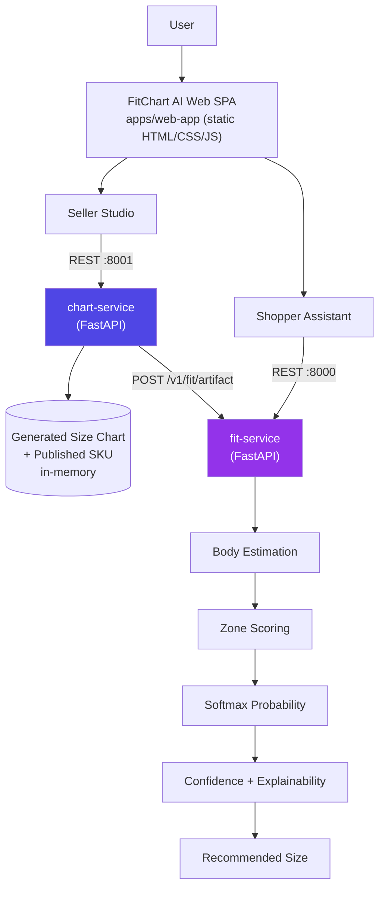

# FitChart AI

AI-assisted apparel sizing intelligence that helps sellers generate size charts and shoppers receive personalized, explainable fit recommendations.


> **Honesty note.** This repo contains two layers: a **working MVP** (documented below, source of truth) and a set of forward-looking **design documents** in [`docs/00-EXECUTIVE-BRIEF.md`](docs/00-EXECUTIVE-BRIEF.md) through [`docs/07-INNOVATIONS-AND-DEMO.md`](docs/07-INNOVATIONS-AND-DEMO.md) describing a larger target architecture (multi-agent orchestration frameworks, trained ML models, a production database, etc.) that is **not** implemented in code. Every claim in this README is verified against the actual source in `services/` and `apps/`. Anything mocked is labeled **DEMO/MOCK** explicitly.

> **V2 upgrade.** Optional direct measurements, a body-profile signal, size-vs-neighbor comparisons, fit-risk classification, formal no-suitable-size handling, seller fit-type/stretch-level controls, and a 20-test pytest suite. Full V1→V2 table in [`docs/v2-improvements.md`](docs/v2-improvements.md).

---

## 🖥️ Application Preview

Screenshots are not yet committed to this repository — see [§ Screenshots to capture](#-screenshots-still-needed) at the end of this document for the exact list and filenames expected under `docs/images/`.

---

## 🚀 Overview

Apparel sizing is inconsistent across sellers, brands, and fabrics, which drives a large share of e-commerce returns. **FitChart AI** addresses two sides of that problem:

- **Sellers** get a fast way to turn fabric composition into a size chart with per-cell explanations, instead of manually estimating measurements.
- **Shoppers** get a real-time, explainable size recommendation from their height, weight, and fit preference — instead of guessing from a static chart.

**What is implemented today:** two independent FastAPI services (a seller "write path" and a shopper "hot path"), a deterministic zone-based fit-scoring engine, and a single-page vanilla JS/HTML/CSS frontend.

**What is demo/mock:** computer-vision garment measurement, OCR tech-pack parsing, and the multi-agent pipeline visualization (the animation is real; the underlying "agents" are not separate AI processes — see [§ Current Limitations](#️-current-limitations)).

---

## 🎯 Problem Statement

- Garment measurements are inconsistent between sellers, brands, and even between sizes within one catalog.
- Sellers typically build size charts manually or copy them from a manufacturer, without a systematic way to explain *why* a measurement is what it is.
- Shoppers only know their body measurements (or a size they've worn before) — not how those measurements map onto a specific garment's chart, fabric stretch, or expected shrinkage.
- Fit preference (tight / regular / relaxed) changes how much ease a shopper actually wants, but most size charts assume one fixed fit.
- Cotton-heavy fabrics shrink after washing, which a static chart never accounts for.
- The hackathon problem statement this project was built for cites that a large share of apparel e-commerce returns are size-related — that figure comes from the original problem statement document, not from any measurement performed by this system.

---

## 💡 Solution

### Seller workflow
```
Product info + fabric composition + (optional) garment image / tech-pack
        → chart-service (:8001)
        → generated per-size measurements with explanations
        → published SKU + Fit Artifact
```

### Shopper workflow
```
SKU + height + weight + fit preference + wash horizon + (optional) usual size
        → fit-service (:8000)
        → estimated body zones
        → zone-level scoring against the garment chart
        → softmax probability distribution across S/M/L/XL
        → confidence + fit quality + recommended size
        → deterministic, template-based explanation
```

Both services are stateless FastAPI apps with **in-memory** storage — there is no database. `chart-service` computes a chart and pushes a compact "Fit Artifact" to `fit-service`, which is the only thing the shopper-facing endpoint reads.

---

## 🏗️ System Architecture



Both services also accept file uploads (`POST /v1/skus/{id}/assets` on `chart-service`) for garment images and tech-pack PDFs; extraction from those files is **mocked** (see [§ Current Limitations](#️-current-limitations)).

---

## 🔄 End-to-End Workflow

```mermaid
flowchart LR
    subgraph Seller
        A1[Product info] --> A2[Garment / fabric inputs]
        A2 --> A3["chart-service<br/>/v1/skus"]
        A3 --> A4["/generate-chart<br/>(mock GME + mock CV/OCR)"]
        A4 --> A5[Generated measurements + explanations]
        A5 --> A6[Published Size Chart + SKU]
    end

    subgraph Shopper
        B1[SKU] --> B2[Body info: height, weight]
        B2 --> B3[Fit preference]
        B3 --> B4[Wash horizon]
        B4 --> B5["fit-service<br/>/v1/fit/recommend"]
        B5 --> B6[Body-zone estimation]
        B6 --> B7["Compare vs. garment measurements"]
        B7 --> B8[Zone scoring]
        B8 --> B9[Weighted overall score]
        B9 --> B10[Softmax probabilities]
        B10 --> B11[Confidence + Fit Quality]
        B11 --> B12[Recommended size]
        B12 --> B13[Deterministic explanation]
    end

    A6 -.->|"Fit Artifact pushed"| B5
```



---

## 🧠 Fit Recommendation Logic

This section documents the **exact** implementation in `services/fit-service/main.py`.

### 1. Body Measurement Estimation

`estimate_body_zones()` converts height (cm) and weight (kg) into four estimated body zones — `shoulder`, `chest`, `waist`, `sleeve` — using linear coefficients calibrated against two reference points (an average 175cm/75kg adult and a larger 185cm/100kg adult), so estimates stay inside the range the garment chart actually covers:

```python
shoulder = 0.20 * height + 0.12 * weight - 1.0
chest    = 0.35 * height + 0.50 * weight - 2.75
waist    = 0.10 * height + 0.44 * weight + 30.5
sleeve   = 0.337 * height
```

This is a deterministic MVP heuristic, not a trained or dataset-fit model.

### 2. Fit Preference

`PREFERENCE_EASE_MULT = {"tight": 0.55, "regular": 1.0, "relaxed": 1.6}` scales how much ease (room) a size needs relative to a chart's baseline ease values. A relaxed preference multiplies the required ease by 1.6×; tight reduces it to 0.55×.

### 3. Zone-Level Fit Scoring

For every size and every zone (`score_zone()`):

```python
error = abs(slack - target_ease)
score = exp(-error / scale)
if slack < 0:
    score *= 0.2   # strong penalty when the garment is physically smaller than the body
```

`slack` is the effective garment dimension (after shrinkage and stretch) minus the estimated body measurement. `scale` is a fixed per-zone constant (`sigma`) from the garment's Fit Artifact.

### 4. Weighted Overall Score

```python
ZONE_WEIGHTS = {"shoulder": 0.20, "chest": 0.35, "waist": 0.30, "sleeve": 0.15}
overall_score = sum(ZONE_WEIGHTS[z] * zone_scores[z] for z in zones)
```

### 5. Probability Distribution

A softmax (temperature `0.15`) over each size's `overall_score` produces the fit-probability distribution:

```python
p_fit[size] = exp((score[size] - max_score) / 0.15) / sum(exp((score[j] - max_score) / 0.15) for j in sizes)
```

Because softmax normalizes by the sum of all exponentials, probabilities across S/M/L/XL always sum to ~100% (subject to 3-decimal display rounding).

**Optional usual-size calibration.** If the shopper provides a self-reported "usual size," a small Gaussian-shaped prior over ordinal size-distance is blended in *after* softmax: `final_p_fit = 0.80 × body_fit_probability + 0.20 × normalized_usual_size_prior`. This is a minor calibration signal, not a lookup or override — with no usual size provided, `final_p_fit` equals the pure body-fit probability exactly.

### 6. Confidence

The current, tuned formula (not the original version):

```python
normalized_overall = min(1.0, best_score / 0.5)
normalized_binding = min(1.0, best_binding_zone_score / 0.35)
best_fit_quality = 0.7 * normalized_overall + 0.3 * normalized_binding

winner_margin = (best_p_fit - second_p_fit) / best_p_fit   # relative margin over the runner-up
confidence = clamp(0.70 * best_fit_quality + 0.30 * winner_margin, 0, 1)
```

Confidence always reads the size's **pure, unblended** physical fit score — the usual-size prior can shift *which* size wins, but never inflates the confidence number itself.

### 7. Fit Quality

```python
if best_fit_quality >= 0.65: "Good fit"
elif best_fit_quality >= 0.35: "Fair fit"
else: "Poor fit"
```

### 8. Explainability

All explanation text is built by `build_explanations()` from the numbers computed above — **plain Python string templates, not an LLM call**. It identifies:

- The recommended size and its chest/waist ease in cm.
- The **binding zone** (the size's worst-scoring zone).
- A smaller size that was rejected, with its specific insufficient-ease zone and value.
- Whether fabric stretch provided extra tolerance.
- A post-wash shrinkage forecast, if a wash horizon was given.
- Whether a self-reported usual size agrees or disagrees with the recommendation.

---

## 📊 Example Recommendation

Verified live against the running endpoint immediately before writing this document:

**Input:**
```json
{"sku_id": "sku_demo_1", "body": {"height_cm": 187, "weight_kg": 83.5, "fit_preference": "relaxed"}, "wash_horizon": 0}
```

**Output:**
```
Recommended Size: L
Confidence: 49.6%
Fit Quality: Fair fit
Probabilities: S 7.7% · M 7.8% · L 60.0% · XL 24.5%
```

**Why:** L's binding zone is the sleeve (−2.02cm slack — slightly tight), but its chest (+3.55cm) and waist (+4.06cm) ease are close to the relaxed-fit target, giving it the best overall balance. S is explicitly rejected: "S rejected because chest has insufficient ease (−12.4 cm)."

---

## 🧪 Verification / Testing

In addition to the 20-test automated `pytest` suite (`tests/`, see [§ Technology Stack](#️-technology-stack)), the fit-scoring logic was verified manually against five cases, run directly through the live `POST /v1/fit/recommend` endpoint:

| Case | Height | Weight | Preference | Recommended | Confidence | Fit Quality |
|------|--------|--------|------------|--------------|------------|--------------|
| 1 | 187cm | 83.5kg | Relaxed | L | 49.6% | Fair fit |
| 2 | 170cm | 60kg | Regular | S | 86.5% | Good fit |
| 3 | 185cm | 100kg | Relaxed | XL | 78.4% | Good fit |
| 4 | 160cm | 50kg | Tight | S | 4.3% | Poor fit |
| 5 | 205cm | 165kg | Relaxed (extreme) | XL | 0.0% | Poor fit |

Additional checks performed:
- **Probability-sum validation** — every case's `per_size[].p_fit` values sum to ~100%.
- **Extreme-case handling** — case 5 (an unrealistically large body) correctly returns "Poor fit" with 0% confidence rather than a misleadingly confident size.
- **Endpoint testing** — all cases were run against the live server via `curl`/`TestClient`, not just as isolated function calls.
- **API compatibility** — the optional `usual_size` field was added to the request schema without changing any existing field; omitting it reproduces byte-identical output to the pre-feature version.

---

## 🛠️ Technology Stack

**Language:** Python 3.14, JavaScript (ES2020, vanilla, no framework)

**Backend / API:**
- [FastAPI](https://fastapi.tiangolo.com/) — both services
- [Pydantic v2](https://docs.pydantic.dev/) — request/response validation
- [Uvicorn](https://www.uvicorn.org/) — ASGI server
- REST over HTTP/JSON, plus `multipart/form-data` for file uploads
- `python-multipart` — required by FastAPI for file-upload parsing (`chart-service` only)

**Frontend:**
- Static HTML5 / CSS3 / vanilla JavaScript — no build step, no bundler
- [Font Awesome](https://fontawesome.com/) (CDN) — icons
- Google Fonts "Inter" (CDN) — typography

**Styling:** Hand-written CSS (custom properties for theming, CSS Grid/Flexbox, no CSS framework)

**Testing:** `pytest` — 20 tests across both services in `tests/` (`tests/test_fit_service.py`, `tests/test_chart_service.py`), covering business-correctness cases: slim/average/large/extreme bodies, tight/relaxed preference, optional measurements, shrinkage, no-suitable-size, probability-sum and confidence-bounds invariants, and backward compatibility. Run: `pip install -r tests/requirements.txt && pytest tests/ -v`.

**Build/Development:** None required — both services run directly via `uvicorn`; the frontend is opened as a static file.

**Other libraries:** None. No database driver, no ORM, no ML/CV libraries are imported anywhere in `services/`.

---

## 📁 Project Structure

```
Hackathon Project/
├── apps/
│   ├── web-app/              ← current frontend (single-page app)
│   │   ├── index.html
│   │   ├── style.css
│   │   └── app.js
│   ├── web-seller/            ← earlier single-purpose prototype (superseded by web-app)
│   └── web-widget/             ← earlier single-purpose prototype (superseded by web-app)
├── services/
│   ├── fit-service/             ← shopper hot path (FastAPI, :8000)
│   │   ├── main.py
│   │   └── requirements.txt
│   └── chart-service/            ← seller write path (FastAPI, :8001)
│       ├── main.py
│       └── requirements.txt
├── docs/
│   ├── architecture.md            ← current-state system architecture (this submission)
│   ├── workflow.md                 ← current-state seller/shopper workflow diagrams
│   ├── fit-algorithm.md             ← current-state fit-scoring pipeline diagram
│   ├── v2-improvements.md            ← V1 → V2 feature table
│   ├── images/                       ← screenshots (see below)
│   └── 00–07-*.md                     ← original target-architecture design docs (aspirational — see note at top of each file)
├── tests/
│   ├── requirements.txt        ← pytest + httpx
│   ├── test_fit_service.py
│   └── test_chart_service.py
├── README.md
└── .gitignore
```

---

## ⚙️ Installation

```bash
# 1. Clone the repository
git clone https://github.com/sairaghu401-cloud/Fit_Chart_Generator.git
cd Fit_Chart_Generator

# 2. Create a Python virtual environment (recommended)
python -m venv .venv
.venv\Scripts\activate        # Windows
# source .venv/bin/activate   # macOS/Linux

# 3. Install dependencies for each service
pip install -r services/fit-service/requirements.txt
pip install -r services/chart-service/requirements.txt
```

No Node.js, database, or additional setup is required — the frontend is static.

---

## ▶️ Running the Application

**Terminal 1 — chart-service (seller write path):**
```bash
cd services/chart-service
uvicorn main:app --port 8001
```

**Terminal 2 — fit-service (shopper hot path):**
```bash
cd services/fit-service
uvicorn main:app --port 8000
```

**Then:** open `apps/web-app/index.html` directly in a browser (double-click it, or use a simple static server). The frontend calls `http://localhost:8001` and `http://localhost:8000` directly — no build step, no dev server required.

If either service is unreachable, the frontend automatically switches to a client-side **Demo Mode** (a visible banner appears) using simulated data that mirrors the real scoring math, so a backend outage during a live demo doesn't interrupt the walkthrough.

---

## 🔌 API Endpoints

### `chart-service` (`http://localhost:8001`)

| Method | Path | Purpose |
|---|---|---|
| GET | `/healthz` | Liveness check |
| POST | `/v1/skus` | Create a SKU |
| POST | `/v1/skus/{sku_id}/assets` | Upload a garment image or tech-pack PDF (mock extraction, never persisted to disk) |
| POST | `/v1/skus/{sku_id}/generate-chart` | Generate and publish the size chart for a SKU |
| GET | `/v1/skus/{sku_id}/chart` | Fetch the published chart |

**`POST /v1/skus`**
```json
// Request
{"name": "Slim Fit Cotton Shirt", "category": "shirt", "fabric": {"composition": {"cotton": 98, "elastane": 2}, "gsm": 180, "is_preshrunk": false}}
// Response
{"sku_id": "sku_ab12cd34", "name": "Slim Fit Cotton Shirt", "category": "shirt", "fabric": {...}}
```

**`POST /v1/skus/{sku_id}/generate-chart`**
```json
// Response (abbreviated)
{"sku_id": "sku_ab12cd34", "version": 1, "status": "published", "generated_in_ms": 7200.0,
 "sizes": [{"label": "M", "chest_cm": 100.0, "waist_cm": 84.0, "explanations": {...}, "post_wash": {...}}, ...],
 "outlier_flags": [], "artifact": {...}}
```

### `fit-service` (`http://localhost:8000`)

| Method | Path | Purpose |
|---|---|---|
| GET | `/healthz` | Liveness check |
| GET | `/v1/fit/artifact/{sku_id}` | Fetch the Fit Artifact for a SKU |
| POST | `/v1/fit/artifact` | (Internal) receive an artifact pushed by chart-service |
| POST | `/v1/fit/recommend` | Get a fit recommendation |

**`POST /v1/fit/recommend`**
```json
// Request
{"sku_id": "sku_demo_1",
 "body": {"height_cm": 187, "weight_kg": 83.5, "fit_preference": "relaxed", "usual_size": "L"},
 "wash_horizon": 0}
// Response (abbreviated)
{"recommended_size": "L", "confidence": 0.496, "fit_quality": "Fair fit",
 "per_size": [{"size": "S", "binding_zone": "chest", "zone_slack_cm": {...}, "p_fit": 0.077}, ...],
 "explanations": ["Recommended L because...", "S rejected because..."],
 "privacy": {"raw_image_retained": false, "processed": "server-mock"},
 "trace_id": "...", "latency_ms": 0.21}
```

`chest_cm`/`weight_kg`/`usual_size` etc. are the only fields the frontend actually sends; both endpoints above are the only ones the UI calls in the running app.

---

## 🔐 Privacy / Data Handling

- Garment images and tech-pack PDFs uploaded via `POST /v1/skus/{sku_id}/assets` are read into memory only to measure their size, then discarded — confirmed in code (`await file.read()` → `del contents`); **no file is ever written to disk**.
- No body photo capture exists anywhere in this application — the shopper form only accepts typed height/weight/measurements.
- Both services store all state (SKUs, charts, artifacts) **in memory only**; nothing is persisted to a database or disk. Restarting either service clears all data.
- The shopper form requires an explicit consent checkbox before a recommendation request is sent.
- There is no authentication, no encryption layer, and no production data-retention policy — this is a local, single-process demo, not a deployed service.

---

## ⚠️ Current Limitations

Documented transparently, not as a disclaimer but as an accurate scope statement:

- **Computer vision and OCR are mocked.** `POST /v1/skus/{sku_id}/assets` accepts real files and returns a fixed mock JSON payload (`detected_category`, `landmarks_found`, `ocr_confidence`, etc.) — no vision or OCR model actually runs.
- **The "multi-agent pipeline" is a UI visualization, not a running multi-agent system.** The frontend animates named stages (Image Agent, Fabric Agent, etc.) while the real (or simulated) HTTP calls happen underneath; there is no LangGraph, no separate agent processes, and no LLM call anywhere in this codebase.
- **Body measurements are estimated, not measured.** `estimate_body_zones()` is a hand-calibrated linear heuristic, not a model trained on a body-measurement dataset.
- **No machine-learning model is trained anywhere in this repository.** The fit-scoring math (zone scoring, softmax, confidence) is deterministic arithmetic, not a learned model.
- **Explanations are deterministic templates, not LLM-generated text.**
- **Only one garment category** (`shirt`) has real dimension data; other categories fall back to the same shirt dimensions.
- **No persistent database.** All state is in-memory Python dictionaries and is lost on restart.
- **No authentication or multi-tenant isolation.**
- **Size availability/inventory is not modeled** — every size is always treated as purchasable.
- **No production deployment configuration** (no Docker, no CI/CD) is present in this repository, despite being described in the aspirational `docs/00-07` design documents.

---

## 🚀 Future Improvements

Realistic next steps, clearly **not implemented**:

- Real computer-vision-based garment measurement extraction from uploaded images.
- A calibrated or dataset-trained body-measurement model (e.g. fit against a public body-measurement dataset).
- Larger and more diverse garment category and size-range coverage.
- Personalized fit learning from a shopper's historical purchase/return outcomes.
- A production database (Postgres/similar) replacing in-memory storage.
- Retailer/e-commerce platform integrations.
- Authentication and multi-tenant access control.
- Usage analytics and a model-monitoring/eval pipeline.
- Real-world validation of the fit-scoring formulas against actual return-rate data.

---

## 🏆 Hackathon Value

- **Seller-side automation:** a size chart with per-cell explanations is generated in one request instead of manual estimation.
- **Shopper personalization:** recommendations account for fit preference, wash/shrinkage forecasting, and (optionally) a shopper's usual size — not just a static lookup table.
- **Explainable by construction:** every number shown to a user traces back to a deterministic formula in `build_explanations()` — there is no black-box model to distrust.
- **Fast inference:** the shopper-facing endpoint does no model inference — it's closed-form arithmetic, typically well under 1ms server-side (verified: `latency_ms` in the example above is `0.21`).
- **Service separation:** the seller write path and shopper read path are independent, individually runnable FastAPI services communicating over REST — not a single monolith.
- We do **not** claim a measured reduction in size-related returns; no return data has been collected or evaluated by this system.

---

## 👥 Team

| Member | Role | GitHub |
|---|---|---|
| Malluri Sai Raghu | Project Development & Integration | [@sairaghu401-cloud](https://github.com/sairaghu401-cloud) |
| Chalamsetti Sai Bhanu Prakash | Project Development & Integration | `2300080185` (institutional/roll ID — not a verified GitHub username) |

---

## 📄 License

No `LICENSE` file currently exists in this repository. If you'd like to publish under an open-source license (MIT, Apache-2.0, etc.), add a `LICENSE` file — this was intentionally left unset rather than assumed.

---

## 🖼️ Screenshots still needed

The following captures are recommended for a judge to understand the app in 2–3 minutes, but none currently exist in this repository. Please capture the running app (`apps/web-app/index.html` with both services up) and save under `docs/images/` using these exact filenames so the links above resolve:

| Filename | Screen to capture |
|---|---|
| `docs/images/01-dashboard.png` | Full page top (hero + both Seller Studio and Shopper Assistant panels visible) |
| `docs/images/02-seller-studio.png` | Seller Studio after clicking "Generate AI Size Chart" — showing the generated table |
| `docs/images/03-shopper-recommendation.png` | Shopper Assistant after clicking "Get AI Recommendation" — showing the confidence ring |
| `docs/images/04-fit-analysis.png` | The "Why This Size?" / probability bars / explanation section, scrolled into view |
| `docs/images/05-dark-mode.png` | Same dashboard with dark mode toggled on (top-right moon/sun icon) |

Once added, uncomment/insert `` lines under [§ Application Preview](#️-application-preview) at the top of this file.
