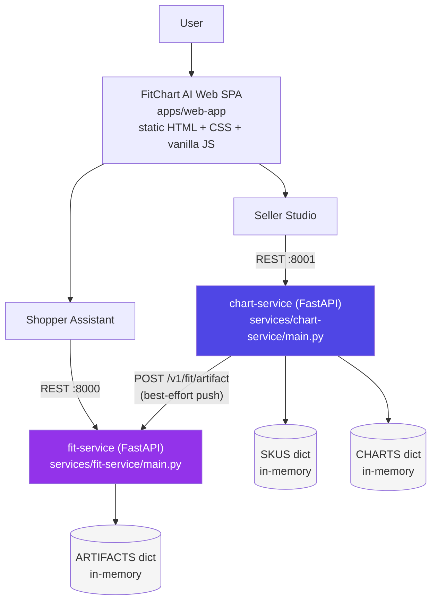

# System Architecture (current implementation)

> This document describes what is **actually implemented and running** in this repository. For the original, broader target-architecture vision (multi-agent orchestration, real CV/OCR models, a production database, etc. — not implemented), see [`00-EXECUTIVE-BRIEF.md`](00-EXECUTIVE-BRIEF.md) through [`07-INNOVATIONS-AND-DEMO.md`](07-INNOVATIONS-AND-DEMO.md).

## High-level system architecture

## What each box actually is

| Component | Reality |
|---|---|
| `apps/web-app` | Static `index.html` + `style.css` + `app.js`. No framework, no build step, no bundler. Opened directly as a file. |
| `chart-service` | A single FastAPI process on port 8001. Owns SKU creation, size-chart generation, and file upload (mock extraction only). |
| `fit-service` | A single FastAPI process on port 8000. The only service the shopper-facing recommendation call touches. Does no model inference — closed-form arithmetic. |
| `SKUS` / `CHARTS` / `ARTIFACTS` | Plain Python `dict`s living in each process's memory. **Not a database.** Wiped on every restart. |
| The "artifact push" | `chart-service` makes a best-effort `urllib` HTTP call to `fit-service` after a chart is published; if `fit-service` is down, the call silently fails and is not retried. |

## Explicitly not present

No API gateway, no message queue, no vector database, no Redis/Postgres, no container orchestration, no LangGraph or agent framework, no authentication layer. Two Python processes and a static page are the entire running system.
