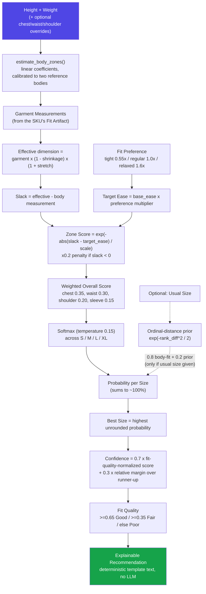

# Fit-Scoring Algorithm (current implementation)

Source of truth: `services/fit-service/main.py`. This is the most important diagram for judging — it is the actual decision pipeline behind every recommendation, with no hidden model calls.

## Notes on fidelity

- Every box above corresponds to a real function or code block in `services/fit-service/main.py` — nothing here is aspirational.
- The dashed "Usual Size" path only activates when the shopper provides one; the rest of the pipeline is byte-identical whether or not it's used.
- `Confidence` and `Fit Quality` are computed from the winning size's **pure, unblended** zone scores — the usual-size prior can change *which* size wins, but never inflates the confidence number.
- There is no branch anywhere in this pipeline that calls an LLM, a vision model, or a trained ML model. Every arrow is closed-form arithmetic.
