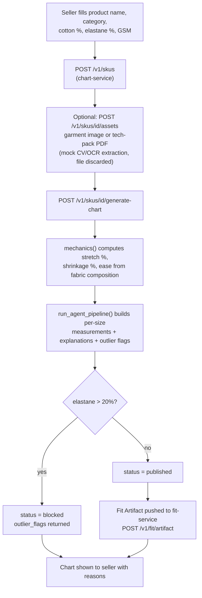
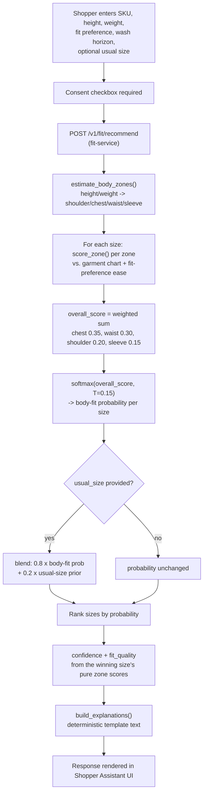

# End-to-End Workflow (current implementation)

## Seller workflow

## Shopper workflow

If either service is unreachable, `apps/web-app/app.js` detects the failure (4-second timeout) and falls back to a client-side simulation that mirrors this same math, clearly labeled "Simulated" in the UI.
